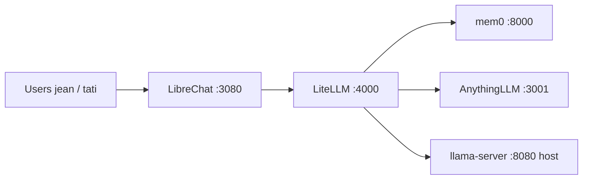

# Chronos Chat

[](LICENSE)
[](https://github.com/Magonitte/Chronos_Chat)
[](requirements-dev.txt)

**Chronos Chat** is a self-hosted personal AI stack for two isolated users: long-term memory (mem0), document RAG (AnythingLLM), multimodal chat (vision), and a ChatGPT-style UI — **100% on your machine, no cloud inference**.

Repository: [github.com/Magonitte/Chronos_Chat](https://github.com/Magonitte/Chronos_Chat)

---

## Features

| Area | What you get |
|------|----------------|
| **Chat** | LibreChat UI on `:3080`, single custom endpoint to LiteLLM |
| **Inference** | llama.cpp TurboQuant on Windows host `:8080` (Qwen3.6-35B + vision) |
| **Memory** | mem0 episodic memory per `user_id`, PRE/POST orchestration |
| **RAG** | AnythingLLM workspaces; retrieval only when `rag_policy` approves |
| **Privacy** | No external LLM APIs; secrets stay in local `.env` |
| **Quality** | 230+ unit/integration tests for policies, context budget, hooks |

---

## Architecture

**LiteLLM is the hub.** LibreChat is a thin UI and must not call mem0 or AnythingLLM directly.



### Message flow

1. User sends text and/or image via LibreChat.
2. LibreChat forwards **only** to LiteLLM (`/v1/chat/completions`).
3. **PRE-CALL** (`hooks/pre_call` → `orchestration/`): validate `X-User-Id`, mem0 search, optional RAG, `context_builder`, inject system context.
4. LiteLLM proxies to llama.cpp at `host.docker.internal:8080`.
5. **POST-CALL**: `memory_policy.should_persist` → `mem0_client.add` when appropriate.
6. Response streams back to LibreChat.

### Design rules (do not break)

- No keyword-only RAG (`if "pdf" in prompt`); use `rag_policy.should_trigger`.
- No `import litellm` inside `config/litellm/orchestration/`.
- No default/fallback `user_id` — missing or invalid `X-User-Id` → HTTP 400.
- Do not change validated llama-server flags without re-benchmarking (see [Backend llama.cpp](#backend-llamacpp)).

### Context budget (131k tokens)

Default allocation on `CTX_TOTAL=131072`:

| Slice | Share | Role |
|-------|-------|------|
| Response reserve | 20% | Space for model output |
| Conversation | 30% | Recent chat history |
| mem0 | 5% (configurable via `CTX_BUDGET_MEM0_PCT`) | Retrieved memories |
| RAG | 30% | Document chunks |

Tune via `CTX_*` variables in `.env.example`.

---

## Stack

| Component | Role | Where |
|-----------|------|--------|
| **LibreChat** | Web UI | Docker `:3080` |
| **LiteLLM** | Hub + orchestration hooks | Docker `:4000` |
| **llama.cpp** | LLM + vision | Windows host `:8080` |
| **mem0** | Long-term memory API | Docker `:8000` |
| **AnythingLLM** | RAG / documents | Docker `:3001` |

Reference hardware (tested): see [Hardware.md](Hardware.md).

---

## Prerequisites

- **Windows 11** (or Windows 10) with Docker Desktop running
- **Python 3.11+** for tests (`pip install -r requirements-dev.txt`)
- **llama.cpp TurboQuant** build with `llama-server.exe` ([TheTom/llama-cpp-turboquant](https://github.com/TheTom/llama-cpp-turboquant))
- GGUF chat model + `mmproj` for vision (paths configured locally)
- ~32 GB RAM and a discrete GPU recommended for the 35B MoE setup

---

## Installation

```powershell
git clone https://github.com/Magonitte/Chronos_Chat.git
cd Chronos_Chat

# Environment
copy .env.example .env
# Edit .env — replace ALL change-me-* placeholders with strong random secrets

# llama paths (not committed)
copy scripts\llama-paths.local.bat.example scripts\llama-paths.local.bat
# Edit LLAMA_DIR, MODEL_PATH, MMPROJ_PATH (and optional EMBED_MODEL_PATH)

# First-time mem0 image
docker compose build mem0
```

---

## Configuration

### Root `.env`

| Variable | Purpose |
|----------|---------|
| `LITELLM_MASTER_KEY` | LiteLLM proxy auth (also LibreChat custom endpoint key) |
| `JWT_*`, `CREDS_*`, `MEILI_*` | LibreChat crypto / search |
| `MEM0_*` | Postgres + mem0 app settings |
| `ANYTHINGLLM_*` | RAG service; set `ANYTHINGLLM_API_KEY` after UI onboarding |
| `LLAMA_API_BASE` | Default `http://host.docker.internal:8080/v1` |
| `ALLOWED_USER_IDS` | Comma list, default `jean,tati` |
| `CTX_*` | Context budget percentages |

See [.env.example](.env.example) for the full list.

### LibreChat users

Register accounts with usernames **`jean`** or **`tati`** (lowercase). LibreChat sends `X-User-Id` from the username via `config/librechat/librechat.yaml`. Details: [config/librechat/user-mapping.md](config/librechat/user-mapping.md).

### AnythingLLM API key

1. Open `http://localhost:3001` after the stack is up.
2. Create workspaces (see `config/anythingllm/workspaces.yaml`).
3. Generate an API key in Settings → API Keys.
4. Set `ANYTHINGLLM_API_KEY` in `.env` and restart LiteLLM.

---

## Run locally

### Daily startup order

**1. llama-server (host, before Docker chat)**

```bat
scripts\Server_Qwen3.6-35B.bat
```

Or from repo root: `Server_Qwen3.6-35B.bat`

Verify:

```powershell
curl.exe http://127.0.0.1:8080/v1/models
```

**2. Docker stack**

```bat
scripts\start-stack.bat
```

Equivalent: `docker compose up -d` then `scripts\health-check.bat --wait`.

**3. Health check**

```bat
scripts\health-check.bat
```

**4. Chat**

- UI: **http://localhost:3080**
- Model: **NewChat** / `newchat`
- Test memory: *"Lembre que meu time é o Atlético"*
- RAG: ask with explicit document phrasing (policy-based), ingest PDFs at **http://localhost:3001**

### Stop

```powershell
docker compose down
# Close llama-server window or: taskkill /f /im llama-server.exe
```

---

## Backend llama.cpp

Validated launcher: `scripts/Server_Qwen3.6-35B.bat` (requires `llama-paths.local.bat`).

**Do not change** these flags without re-measuring latency and VRAM:

- `--mmproj`, `--image-min-tokens 1024`, `--no-mmproj-offload`
- `-c 131072`, `--fit on --fit-target 1536`, `--flash-attn on`, `--cont-batching`
- `--rope-scaling yarn --rope-scale 4 --yarn-orig-ctx 32768`
- `-b 2048 -ub 512`, `--kv-unified`, `--host 0.0.0.0 --port 8080`

Optional embedder for mem0: `scripts\Server_Qwen3-Embedding-0.6B.bat` on port **8081**.

---

## Tests

```powershell
pip install -r requirements-dev.txt
python -m pytest
```

| Suite | Scope |
|-------|--------|
| `tests/test_*.py` | Policies, context builder, clients, hooks |
| `tests/integration/` | Full pre/post_call chain, user isolation, RAG triggers |

Integration tests against live Docker are optional:

```powershell
python -m pytest tests/integration/ -v
docker compose config
.\scripts\health-check.bat
```

---

## Project layout

```
Chronos_Chat/
├── config/
│   ├── litellm/           # Hub: config.yaml, hooks/, orchestration/
│   ├── librechat/         # UI → LiteLLM only
│   ├── mem0/              # mem0 Docker build
│   └── anythingllm/       # Workspaces + RAG notes
├── scripts/               # llama launchers, health-check, stack helpers
├── tests/                 # pytest suites
├── docker-compose.yml
├── .env.example
├── AGENTS.md              # Guide for AI coding agents
├── Hardware.md            # Reference machine spec
├── LICENSE
└── SECURITY.md
```

Per-service notes: `config/*/README.md`.

---

## Development

1. Read [AGENTS.md](AGENTS.md) for architecture constraints.
2. Business logic lives in `config/litellm/orchestration/`; hooks stay thin.
3. Run `python -m pytest` before opening a PR.
4. Never commit `.env`, `llama-paths.local.bat`, or model weights.

There is no cloud deploy path in this repo — production means your own Windows + Docker host.

---

## Roadmap

| Status | Item |
|--------|------|
| Done | LiteLLM hub F0–F8: mem0, RAG, context budget, `X-User-Id`, vision E2E |
| Planned | **F9** MCP for actions only (not base memory/RAG) |
| Planned | Thinking policy / extended tuning (env-gated) |

---

## Contributing

1. Fork the repository and create a feature branch.
2. Keep changes aligned with the hub architecture (LibreChat → LiteLLM only).
3. Add or update tests for policy/orchestration changes.
4. Follow [SECURITY.md](SECURITY.md) — no secrets in commits.

---

## License

[MIT](LICENSE) — Copyright (c) 2026 Magonitte.
