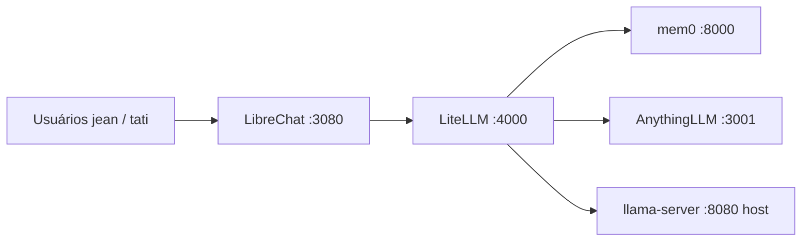

# Chronos Chat

[](LICENSE)
[](https://github.com/Magonitte/Chronos_Chat)
[](requirements-dev.txt)

**Chronos Chat** é um stack de IA pessoal auto-hospedado para dois usuários isolados: memória de longo prazo (mem0), RAG em documentos (AnythingLLM), chat multimodal (visão) e interface estilo ChatGPT — **100% na sua máquina, sem inferência na nuvem**.

Repositório: [github.com/Magonitte/Chronos_Chat](https://github.com/Magonitte/Chronos_Chat)

---

## Funcionalidades

| Área | O que você tem |
|------|----------------|
| **Chat** | Interface LibreChat em `:3080`, endpoint único customizado para o LiteLLM |
| **Inferência** | llama.cpp TurboQuant no host Windows `:8080` (Qwen3.6-35B + visão) |
| **Memória** | mem0 episódica por `user_id`, orquestração PRE/POST |
| **RAG** | Workspaces AnythingLLM; busca só quando `rag_policy` aprovar |
| **Privacidade** | Sem APIs externas de LLM; segredos ficam no `.env` local |
| **Qualidade** | 230+ testes unitários/integração (policies, context budget, hooks) |

---

## Arquitetura

**O LiteLLM é o hub.** O LibreChat é UI fina e **não** deve chamar mem0 nem AnythingLLM diretamente.



### Fluxo de uma mensagem

1. O usuário envia texto e/ou imagem pelo LibreChat.
2. O LibreChat encaminha **somente** para o LiteLLM (`/v1/chat/completions`).
3. **PRE-CALL** (`hooks/pre_call` → `orchestration/`): valida `X-User-Id`, busca mem0, RAG opcional, `context_builder`, injeta contexto no system.
4. O LiteLLM faz proxy para o llama.cpp em `host.docker.internal:8080`.
5. **POST-CALL**: `memory_policy.should_persist` → `mem0_client.add` quando fizer sentido.
6. A resposta volta em streaming para o LibreChat.

### Regras de design (não quebrar)

- Sem RAG por keyword solta (`if "pdf" in prompt`); usar `rag_policy.should_trigger`.
- Sem `import litellm` dentro de `config/litellm/orchestration/`.
- Sem fallback de `user_id` — `X-User-Id` ausente ou inválido → HTTP 400.
- Não alterar flags validadas do llama-server sem re-benchmark (ver [Backend llama.cpp](#backend-llamacpp)).

### Orçamento de contexto (131k tokens)

Alocação padrão com `CTX_TOTAL=131072`:

| Fatia | % | Papel |
|-------|---|--------|
| Reserva de resposta | 20% | Espaço para saída do modelo |
| Conversa | 30% | Histórico recente do chat |
| mem0 | 5% (ajustável via `CTX_BUDGET_MEM0_PCT`) | Memórias recuperadas |
| RAG | 30% | Chunks de documentos |

Ajuste pelas variáveis `CTX_*` em `.env.example`.

---

## Stack

| Componente | Função | Onde roda |
|------------|--------|-----------|
| **LibreChat** | Interface web | Docker `:3080` |
| **LiteLLM** | Hub + hooks de orquestração | Docker `:4000` |
| **llama.cpp** | LLM + visão | Host Windows `:8080` |
| **mem0** | API de memória de longo prazo | Docker `:8000` |
| **AnythingLLM** | RAG / documentos | Docker `:3001` |

Hardware de referência (validado): [Hardware.md](Hardware.md).

---

## Pré-requisitos

- **Windows 11** (ou 10) com Docker Desktop em execução
- **Python 3.11+** para testes (`pip install -r requirements-dev.txt`)
- Build **llama.cpp TurboQuant** com `llama-server.exe` ([TheTom/llama-cpp-turboquant](https://github.com/TheTom/llama-cpp-turboquant))
- Modelo GGUF de chat + `mmproj` para visão (caminhos configurados localmente)
- ~32 GB de RAM e GPU dedicada recomendados para o setup MoE 35B

---

## Instalação

```powershell
git clone https://github.com/Magonitte/Chronos_Chat.git
cd Chronos_Chat

# Ambiente
copy .env.example .env
# Edite .env — troque TODOS os placeholders change-me-* por segredos fortes e únicos

# Caminhos do llama (não versionados)
copy scripts\llama-paths.local.bat.example scripts\llama-paths.local.bat
# Edite LLAMA_DIR, MODEL_PATH, MMPROJ_PATH (e opcional EMBED_MODEL_PATH)

# Primeira vez: imagem mem0
docker compose build mem0
```

---

## Configuração

### `.env` na raiz

| Variável | Finalidade |
|----------|------------|
| `LITELLM_MASTER_KEY` | Auth do proxy LiteLLM (mesma chave no endpoint custom do LibreChat) |
| `JWT_*`, `CREDS_*`, `MEILI_*` | Cripto / busca do LibreChat |
| `MEM0_*` | Postgres + app mem0 |
| `ANYTHINGLLM_*` | Serviço RAG; defina `ANYTHINGLLM_API_KEY` após onboarding na UI |
| `LLAMA_API_BASE` | Padrão `http://host.docker.internal:8080/v1` |
| `ALLOWED_USER_IDS` | Lista separada por vírgula, padrão `jean,tati` |
| `CTX_*` | Percentuais do orçamento de contexto |

Lista completa em [.env.example](.env.example).

### Usuários no LibreChat

Registre contas com username **`jean`** ou **`tati`** (minúsculas). O LibreChat envia `X-User-Id` a partir do username via `config/librechat/librechat.yaml`. Detalhes: [config/librechat/user-mapping.md](config/librechat/user-mapping.md).

### Chave de API do AnythingLLM

1. Abra `http://localhost:3001` com a stack no ar.
2. Crie workspaces (veja `config/anythingllm/workspaces.yaml`).
3. Gere uma API key em Settings → API Keys.
4. Defina `ANYTHINGLLM_API_KEY` no `.env` e reinicie o LiteLLM.

---

## Executar localmente

### Ordem de subida (uso diário)

**1. llama-server (host, antes do chat Docker)**

```bat
scripts\Server_Qwen3.6-35B.bat
```

Ou na raiz do repo: `Server_Qwen3.6-35B.bat`

Conferir:

```powershell
curl.exe http://127.0.0.1:8080/v1/models
```

**2. Stack Docker**

```bat
scripts\start-stack.bat
```

Equivalente: `docker compose up -d` e depois `scripts\health-check.bat --wait`.

**3. Health check**

```bat
scripts\health-check.bat
```

**4. Chat**

- UI: **http://localhost:3080**
- Modelo: **NewChat** / `newchat`
- Testar memória: *"Lembre que meu time é o Atlético"*
- RAG: perguntas com referência explícita a documentos (via policy); ingestão de PDFs em **http://localhost:3001**

### Parar

```powershell
docker compose down
# Feche a janela do llama-server ou: taskkill /f /im llama-server.exe
```

---

## Backend llama.cpp

Launcher validado: `scripts/Server_Qwen3.6-35B.bat` (exige `llama-paths.local.bat`).

**Não altere** estas flags sem medir de novo latência e VRAM:

- `--mmproj`, `--image-min-tokens 1024`, `--no-mmproj-offload`
- `-c 131072`, `--fit on --fit-target 1536`, `--flash-attn on`, `--cont-batching`
- `--rope-scaling yarn --rope-scale 4 --yarn-orig-ctx 32768`
- `-b 2048 -ub 512`, `--kv-unified`, `--host 0.0.0.0 --port 8080`

Embedder opcional para mem0: `scripts\Server_Qwen3-Embedding-0.6B.bat` na porta **8081**.

---

## Testes

```powershell
pip install -r requirements-dev.txt
python -m pytest
```

| Suíte | Escopo |
|-------|--------|
| `tests/test_*.py` | Policies, context builder, clients, hooks |
| `tests/integration/` | Cadeia pre/post_call, isolamento de usuários, triggers RAG |

Testes de integração contra Docker ao vivo são opcionais:

```powershell
python -m pytest tests/integration/ -v
docker compose config
.\scripts\health-check.bat
```

---

## Estrutura do projeto

```
Chronos_Chat/
├── config/
│   ├── litellm/           # Hub: config.yaml, hooks/, orchestration/
│   ├── librechat/         # UI → somente LiteLLM
│   ├── mem0/              # Build Docker mem0
│   └── anythingllm/       # Workspaces + notas RAG
├── scripts/               # Launchers llama, health-check, stack
├── tests/                 # Suítes pytest
├── docker-compose.yml
├── .env.example
├── AGENTS.md              # Guia para agentes de IA
├── Hardware.md            # Spec da máquina de referência
├── LICENSE
└── SECURITY.md
```

Notas por serviço: `config/*/README.md`.

---

## Desenvolvimento

1. Leia [AGENTS.md](AGENTS.md) para restrições de arquitetura.
2. Lógica de negócio em `config/litellm/orchestration/`; hooks permanecem finos.
3. Rode `python -m pytest` antes de abrir PR.
4. Nunca commite `.env`, `llama-paths.local.bat` nem pesos `.gguf`.

Não há deploy em nuvem neste repositório — produção é o seu próprio host Windows + Docker.

---

## Roadmap

| Status | Item |
|--------|------|
| Concluído | Hub LiteLLM F0–F8: mem0, RAG, context budget, `X-User-Id`, visão E2E |
| Planejado | **F9** MCP só para ações (não memória/RAG base) |
| Planejado | Thinking policy / tuning estendido (via env) |

---

## Contribuição

1. Faça fork e crie um branch de feature.
2. Mantenha a arquitetura hub (LibreChat → somente LiteLLM).
3. Adicione ou atualize testes para mudanças em policy/orquestração.
4. Siga [SECURITY.md](SECURITY.md) — sem segredos nos commits.

---

## Licença

[MIT](LICENSE) — Copyright (c) 2026 Magonitte.
